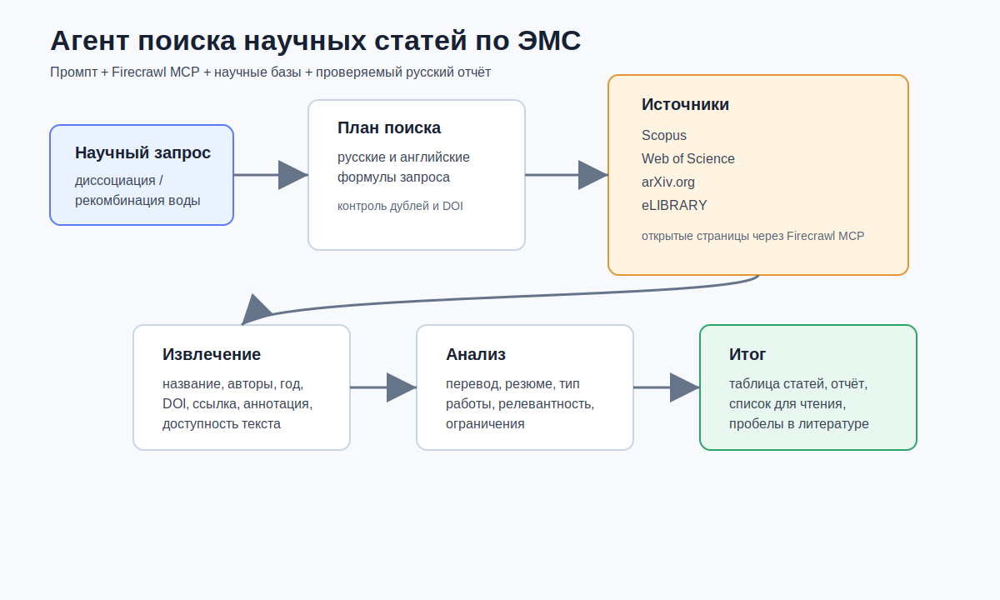

# Агент поиска научных статей по ЭМС

Учебный репозиторий для спецсеминара. Автор: Иван Селиванов.

Проект описывает агента, который ищет и собирает научные работы по теме влияния диссоциации и рекомбинации молекул воды на процессы переноса в электромембранных системах. Агент оформлен как плагин: в репозитории есть описание навыка, системный промпт, конфигурация MCP и отчётная визуализация.

В агент добавлен отдельный слой открытого веб-поиска Firecrawl. Он отвечает за поиск страниц, извлечение материалов статей, проверку DOI, работу с динамическими страницами, разбор законно полученных файлов и расширение подборки через связанные публикации.

## Что делает агент

- формирует поисковые запросы на русском и английском языке;
- ищет теоретические и экспериментальные работы;
- собирает DOI, ссылки, аннотации, сведения о полнотекстовом доступе и библиографические данные;
- переводит названия и аннотации на русский язык;
- делает краткое резюме, научный анализ и пометки о достоверности;
- использует Firecrawl MCP и навыки Firecrawl для открытого поиска, извлечения страниц, карты сайта, ограниченного обхода, разбора файлов и поиска связанных публикаций;
- разделяет результаты по источникам: Scopus, Web of Science, arXiv.org, eLIBRARY, а также открытые веб-источники для дополнительной проверки;
- сохраняет итог в таблицу, краткий отчёт и список статей для дальнейшего чтения.

## Подключение MCP

Для живого поиска подключается готовый сервер Firecrawl MCP. Он используется как внешний инструмент агента для поиска страниц, извлечения содержимого и проверки открытых источников.

```json
{
  "mcpServers": {
    "firecrawl": {
      "command": "npx",
      "args": ["-y", "firecrawl-mcp"],
      "env": {
        "FIRECRAWL_API_KEY": "${FIRECRAWL_API_KEY}"
      }
    }
  }
}
```

Полная конфигурация лежит в [.mcp.json](.mcp.json). Ключи не хранятся в репозитории. Для локального запуска нужно создать `.env` по образцу [.env.example](.env.example).

## Навыки Firecrawl

Слой навыков основан на двух частях Firecrawl:

- живые операции через Firecrawl MCP/CLI: поиск, извлечение, карта сайта, обход разделов, взаимодействие со страницами, разбор локальных файлов;
- навыки из [firecrawl/skills](https://github.com/firecrawl/skills): встраивание Firecrawl в агентный пакет и `firecrawl-research-index` для поиска связанных научных работ.

Внутри проекта этот слой оформлен как отдельный навык [skills/firecrawl-scraping-pipeline/SKILL.md](skills/firecrawl-scraping-pipeline/SKILL.md).

| Навык | Для чего используется |
| --- | --- |
| `firecrawl-search` | находит страницы-кандидаты по поисковой формуле |
| `firecrawl-scrape` | извлекает содержимое известной страницы статьи или препринта |
| `firecrawl-map` | находит нужные URL внутри сайта журнала, выпуска или лаборатории |
| `firecrawl-crawl` | ограниченно обходит небольшой раздел сайта, если нужна серия страниц |
| `firecrawl-interact` | работает со страницами, где нужны переходы, формы, пагинация или раскрытие блоков |
| `firecrawl-parse` | разбирает локальные PDF, HTML и выгрузки, если они получены законно |
| `firecrawl-agent` | выполняет узко ограниченное структурированное извлечение из открытых страниц |
| `firecrawl-research-index` | расширяет подборку через похожие статьи, цитирования и списки литературы |
| `firecrawl-build-onboarding` | проверяет подключение ключа через окружение, без хранения секретов в репозитории |
| `firecrawl-build-*` | помогает встроить Firecrawl в код агента и выбрать правильную конечную точку |

Эти навыки не заменяют Scopus, Web of Science и eLIBRARY. Они дополняют поиск: помогают собрать открытые страницы, аннотации, DOI, ссылки на законно доступные полные тексты и материалы для ручной проверки.

Если среда поддерживает установку навыков, их можно подключить одной командой:

```bash
npx skills add firecrawl/skills
```

Если нужен полный набор живых операций Firecrawl вместе с навыками CLI, удобнее поставить всё сразу:

```bash
npx -y firecrawl-cli@latest init --all --browser
```

## Структура плагина

```text
ems-literature-agent/
├── .claude-plugin/plugin.json
├── .mcp.json
├── agents/ems-literature-agent.md
├── skills/ems-literature-search/SKILL.md
├── skills/firecrawl-scraping-pipeline/SKILL.md
├── prompts/system-prompt.md
├── docs/report.md
└── assets/research-agent-architecture.svg
```

## Визуализация



## Главный промпт агента

Промпт вынесен в [prompts/system-prompt.md](prompts/system-prompt.md). Его можно использовать как готовую инструкцию для запуска агента в среде с подключённым MCP.

Короткая версия:

> Найди и систематизируй теоретические и экспериментальные статьи о влиянии диссоциации и рекомбинации молекул воды на процессы переноса в электромембранных системах. Используй Scopus, Web of Science, arXiv.org, eLIBRARY, Firecrawl MCP и навыки Firecrawl для открытого поиска, извлечения страниц, проверки DOI, разбора законно полученных файлов и расширения подборки по связанным публикациям. Для каждой работы укажи DOI, ссылку, тип исследования, краткое русское резюме, перевод названия, ключевые выводы и оценку релевантности.

## Ограничения

- Scopus и Web of Science требуют институционального доступа или ключей API.
- eLIBRARY может требовать вход в учётную запись.
- Полные тексты статей скачиваются только при наличии законного открытого доступа.
- Если DOI, полный текст или экспериментальные данные не найдены, агент явно пишет `не найдено`, а не придумывает сведения.

## Проверка

Перед сдачей я проверяю три вещи:

```bash
test -f .mcp.json
test -f prompts/system-prompt.md
test -f skills/firecrawl-scraping-pipeline/SKILL.md
```

## Результат

Репозиторий показывает не просто идею, а готовую упаковку агента: есть плагин, подключение MCP, подробный промпт, отчёт и схема работы.
